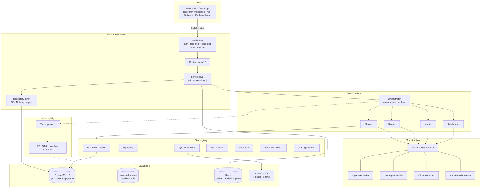
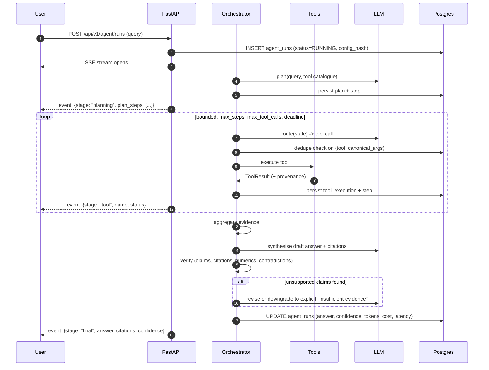
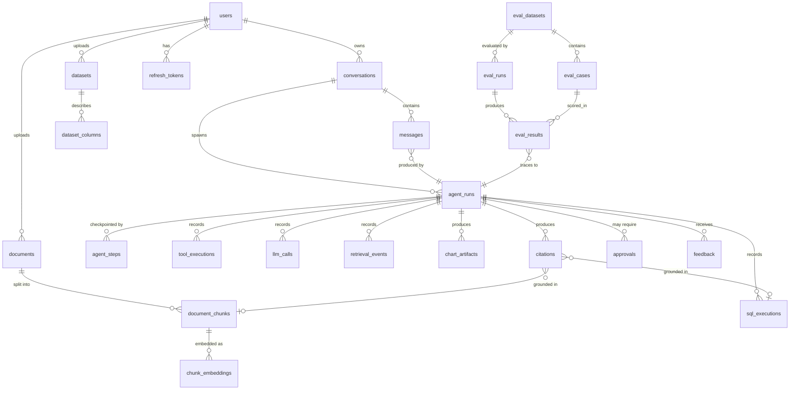
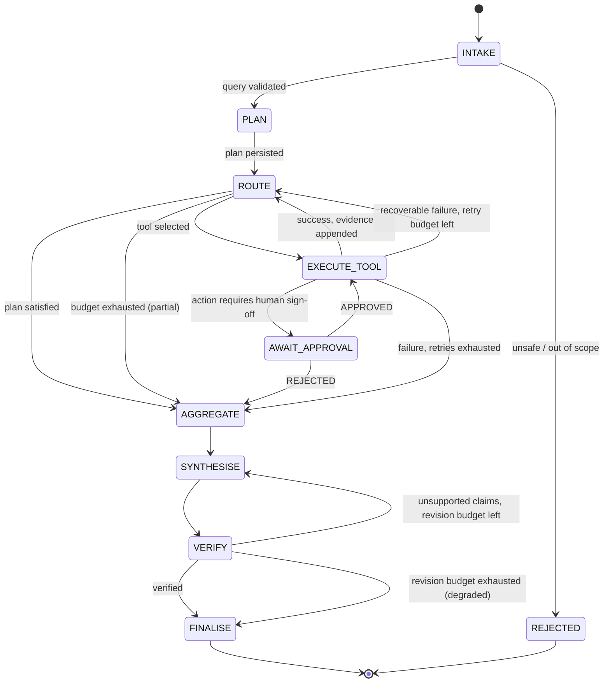
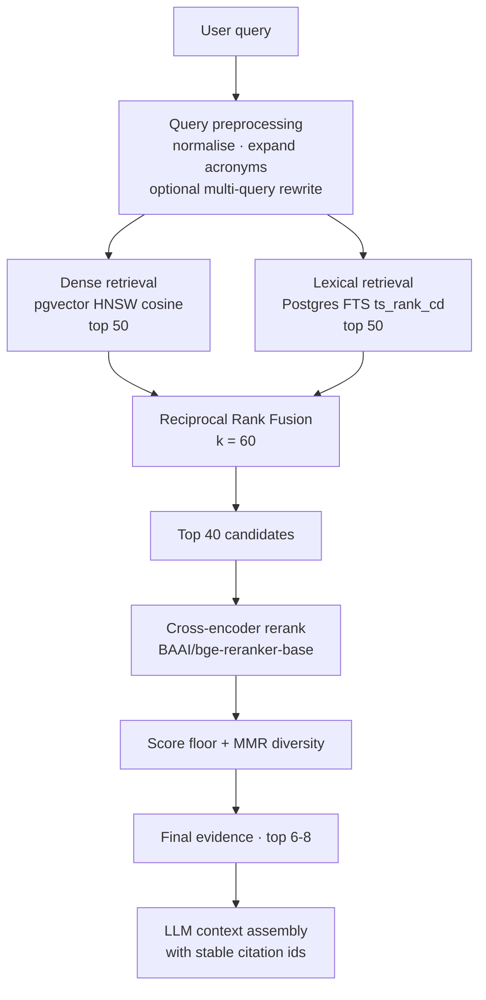

# InsightAgent — Implementation Plan

**Status:** Phase 0 complete (analysis & planning). No application code written yet.
**Author:** Phase 0 architecture review
**Last updated:** 2026-08-09
**Repository:** `E:\projects\InsightAgent` (git initialised, branch `main`)

> This document is the single source of architectural truth for the project. Every
> phase updates it. Anything marked **PLANNED** is not implemented — do not claim
> otherwise in the README, in commits, or in interviews.

---

## Table of contents

1. [Existing repository architecture](#1-existing-repository-architecture)
2. [What currently works](#2-what-currently-works)
3. [Technical problems](#3-technical-problems)
4. [Missing components](#4-missing-components)
5. [Recommended final architecture](#5-recommended-final-architecture)
6. [Database design proposal](#6-database-design-proposal)
7. [AI agent architecture proposal](#7-ai-agent-architecture-proposal)
8. [RAG architecture proposal](#8-rag-architecture-proposal)
9. [Evaluation architecture proposal](#9-evaluation-architecture-proposal)
10. [Security concerns](#10-security-concerns)
11. [Development phase plan](#11-development-phase-plan)
12. [Proposed folder structure](#12-proposed-folder-structure)
13. [Dependencies required](#13-dependencies-required)
14. [Risks and tradeoffs](#14-risks-and-tradeoffs)
15. [Phase 1 implementation checklist](#15-phase-1-implementation-checklist)

---

## 1. Existing repository architecture

**There is none.** This is a greenfield project.

The Claude Code session's working directory was `C:\Users\Shovon` — the Windows user
home folder, not a repository. It was inspected in full before any decision was made:

| Finding | Detail |
| --- | --- |
| Git repository at working dir | No (`.git` absent; home folder is not and must not become a repo) |
| Any pre-existing `InsightAgent` folder | None found on Desktop, Documents, Downloads, or OneDrive |
| Unrelated projects present | `Desktop\nexus_rooppur_mvp`, `Desktop\scanedit-ai`, `Desktop\pothik-app`, `Desktop\Question_generator`, `Mini_Autonomous_SOC`, `SecurityClaw`, `Autonomous Soc` — all unrelated, none reused |
| Stray files in home | `test.py` (114 bytes), `package-lock.json` (85 bytes) — unrelated scratch files, left untouched |

**Decision:** the project was initialised at `E:\projects\InsightAgent` rather than in
the home folder or on `C:`. Rationale in [§14 Risk R1](#r1-c-drive-has-only-165-gb-free)
— `C:` has 16.5 GB free, and this project's local footprint (virtualenv with torch,
`node_modules`, HuggingFace model cache, synthetic corpus) realistically lands at
6–9 GB before Docker images are counted.

### Verified toolchain baseline

Measured on the development machine, not assumed:

| Tool | Version | Notes |
| --- | --- | --- |
| Python | 3.14.5 (`C:\Python314`), 3.11.9 also present | **No 3.12 installed** — see [R2](#r2-system-python-is-314-ahead-of-the-ml-wheel-ecosystem) |
| uv | 0.11.16 | Will manage the pinned interpreter and lockfile |
| Node | 24.16.0 | npm 11.13.0; no pnpm |
| Docker | 29.4.3, daemon reachable, WSL2 backend (`OSType=linux`) | Compose v5.1.3 |
| git | 2.54.0.windows.1 | Identity already configured (`shovon-vubon`) |
| psql client | Not installed | Not blocking — use the `postgres` container's `psql` |
| Ollama | **Not installed** | Required for the local-model provider (Phase 2+) |

### Verified hardware baseline

| Resource | Value | Consequence |
| --- | --- | --- |
| CPU | AMD Ryzen 5 8645HS, 6C/12T | Adequate; CPU reranking viable |
| RAM | 31.3 GB total, 12.3 GB free at scan | Adequate for the full compose stack |
| GPU | NVIDIA RTX 4050 Laptop, **4 GB VRAM** | Fits a cross-encoder reranker and local embeddings. Does **not** fit a competitive local LLM — see [R3](#r3-4-gb-vram-caps-the-local-model-tier) |
| Disk | `C:` 16.5 GB free · `D:` 37 GB · `E:` **154 GB** free | Project on `E:`; Docker data root needs attention |

### Confirmed provider access

OpenAI **and** Anthropic API keys available, **plus** a local Ollama tier (Ollama itself
still to be installed). No keys are currently present in the environment — they will be
supplied via `.env` in Phase 1. This confirms the three-way model comparison in §59 of
the brief is achievable, with the caveat in [R3](#r3-4-gb-vram-caps-the-local-model-tier).

---

## 2. What currently works

Nothing application-level. To be explicit and avoid overclaiming:

| Item | Status |
| --- | --- |
| Git repository at `E:\projects\InsightAgent` | ✅ Initialised, branch `main`, user identity set |
| `.gitignore` | ✅ Written (secrets, venv, node_modules, generated data, model caches) |
| `docs/IMPLEMENTATION_PLAN.md` | ✅ This document |
| Backend | ❌ Not started |
| Frontend | ❌ Not started |
| Database / migrations | ❌ Not started |
| Docker compose | ❌ Not started |
| Everything else | ❌ Not started |

Docker daemon reachability and Compose v2 availability were *verified by execution*, so
Phase 1's containerised path is known-viable before a line of it is written.

---

## 3. Technical problems

Problems that exist **today**, before any code, and that shape the plan:

### P1 — No interpreter matching the target Python version
System Python is 3.14.5. As of the current ML wheel ecosystem, `torch`,
`sentence-transformers`, and several transitive C-extension dependencies do not reliably
publish 3.14 wheels; a source build of torch on Windows is not a reasonable ask.
**Fix:** pin CPython 3.12 via `uv python pin 3.12` and a `.python-version` file. uv will
download and manage it — no system-wide install, no PATH surgery.

### P2 — Disk pressure on the OS drive
Docker Desktop's WSL2 backend stores images and volumes in a VHDX under
`C:\Users\Shovon\AppData\Local\Docker\wsl\`. The planned stack (postgres+pgvector,
redis, backend image with torch, frontend image) plus layer cache will exceed the
16.5 GB free on `C:`. Moving the repo to `E:` does **not** solve this.
**Fix:** relocate Docker's data root to `E:` in Phase 1 before the first `compose up`
(Docker Desktop → Settings → Resources → Advanced → Disk image location). Documented
as a prerequisite step, not left to chance.

### P3 — Windows/Linux runtime divergence
Development is on Windows; production and CI are Linux. Divergences that will bite:
`uvloop` is Linux-only, file-path separators, matplotlib default font availability,
case-sensitive imports, and `asyncpg` behaviour differences are nil but locale/encoding
ones are not.
**Fix:** Docker Compose is the *primary* development path from Phase 1, not an
afterthought. Native-Windows execution is supported for fast unit-test loops only, and
CI runs Linux exclusively.

### P4 — No secrets management story yet
Three provider credentials plus a database password plus a JWT signing key will exist by
Phase 2. There is currently no `.env`, no `.env.example`, and no secret-scanning hook.
**Fix:** Phase 1 delivers `.env.example`, Pydantic `Settings` with fail-fast validation,
and a `gitleaks` (or `detect-secrets`) pre-commit hook. `.gitignore` already excludes
`.env*` with an `!.env.example` negation.

### P5 — PyMuPDF licensing trap
The most convenient PDF text/layout extractor, PyMuPDF, is **AGPL-3.0**. For a public
portfolio repository under a permissive licence this is a real (if unglamorous) problem
and exactly the kind of thing a reviewer notices.
**Fix:** use `pypdf` (BSD) for text and `pdfplumber` (MIT) for layout/table extraction.
Slightly slower, licence-clean.

---

## 4. Missing components

Everything. Grouped by subsystem so the phase plan maps onto it 1:1:

- **Foundation** — repo scaffold, `pyproject.toml`, settings, logging, Docker Compose, health checks, Alembic, auth.
- **LLM layer** — `LLMProvider` protocol, OpenAI/Anthropic/Ollama implementations, a deterministic `FakeProvider` for tests, streaming, usage & cost accounting, retry/fallback.
- **Ingestion** — upload API, validation, extraction (PDF/DOCX/TXT/CSV/XLSX), cleaning, structure-aware chunking, embedding, pgvector storage, ingestion worker, status tracking.
- **Retrieval** — dense, lexical, RRF fusion, cross-encoder reranking, query preprocessing, configurable strategy.
- **SQL agent** — synthetic NovaRetail database, schema retrieval, text-to-SQL, `sqlglot` validator, read-only execution, result explanation.
- **Analysis** — typed pandas operation set, statistics, chart rendering, provenance.
- **Web research** — provider-abstracted search, snippet extraction, citation capture.
- **Orchestration** — state machine, planner, router, bounded loop, step persistence, HITL approval, final synthesis.
- **Verification** — claim extraction, citation validation, numeric cross-check, contradiction detection, calibrated confidence.
- **Evaluation** — dataset, runner, metrics, judge, result storage, regression gate.
- **Observability** — tracer abstraction, DB/OTel/Langfuse exporters, cost aggregation, admin trace viewer.
- **Frontend** — login, research workspace with streaming, knowledge base, datasets, run detail, eval dashboard.
- **Ops** — CI, image builds, security scanning, rate limiting, caching, deployment.

---

## 5. Recommended final architecture

### 5.1 System overview



### 5.2 Key architectural decisions

Each of these is a defensible, arguable call — the reasoning matters more than the
choice, and each will get a short ADR in `docs/adr/`.

#### D1 — Custom state machine, **not** LangGraph

The brief permits either. Choosing **custom** because:

- Our topology is a fixed pipeline (`plan → route → execute → aggregate → verify → synthesise`) with one bounded loop, not an arbitrary graph. That is ~300 lines of explicit, readable Python.
- LangGraph's main value-adds are checkpointing and interrupt-based human-in-the-loop. **We must persist every step to Postgres anyway** for the observability requirement (§26) and the admin trace viewer (§36). Once `agent_steps` exists, checkpointing and resume-from-`PENDING_APPROVAL` are nearly free — LangGraph would give us a *second*, redundant checkpointer.
- A hand-written orchestrator is directly unit-testable with a `FakeProvider` and stub tools, with no framework version churn in the way.
- It demonstrates more engineering ability than wiring a framework, which is the point of the project.

**When to revisit:** if the graph acquires genuine parallel fan-out with conditional
joins, or if we need durable execution across process restarts. Both are noted in the
roadmap, neither is in scope.

**Cost of this decision (stated honestly):** we hand-write retry, timeout, and step
persistence that a framework would supply. Estimated ~2 days of extra work in Phase 7.

#### D2 — pgvector, **not** a separate vector database

- Chunk text, chunk metadata, the `tsvector` lexical index, and the embedding all live in one row. Hybrid retrieval becomes a **single SQL statement** with a CTE per retriever, fused in SQL. With Qdrant, hybrid means two network round-trips plus an ID-join back into Postgres, plus a two-store consistency problem on delete/re-ingest.
- Corpus scale is ~5k–20k chunks. HNSW in pgvector handles that with sub-10 ms recall at k=50. Qdrant's advantages appear at 10M+ vectors.
- One fewer service in Compose, on a disk-constrained machine.

Use `halfvec(1536)` (2-byte floats) with an HNSW index — halves index size at negligible
recall cost for this corpus.

#### D3 — Embeddings in a **separate table**, keyed by model

`chunk_embeddings(chunk_id, embedding_model, embedding_dim, embedding)` rather than an
`embedding` column on `document_chunks`. This makes the embedding model a **first-class
experiment variable**: two embedding models can coexist over the same corpus, and the
evaluation harness can compare them without re-ingesting documents. It also makes the
"never silently mix vector spaces" invariant enforceable with a unique constraint.

#### D4 — Typed analysis operations, **not** LLM-authored arbitrary Python

The brief forbids unrestricted execution (§12). Going further: the default
`python_analysis` tool exposes a **fixed, typed operation set** (`describe`,
`aggregate`, `compare_periods`, `correlate`, `trend`, `plot_line|bar|scatter|hist`), each
with a Pydantic input schema. The LLM chooses an operation and fills arguments — it never
emits code.

Why this is the stronger engineering choice, not the lazy one:
- Every analysis becomes **deterministic and unit-testable**, which is what makes the numeric-verification stage (§20) and the SQL/numeric accuracy metrics possible at all.
- No sandbox escape surface in the default path.
- Tool-selection and argument-filling accuracy become measurable.

A free-form pandas escape hatch inside a locked-down Docker sandbox (no network,
read-only rootfs, non-root, memory/CPU/PID limits, seccomp) is designed for but deferred
to Phase 12 and gated behind both a config flag and human approval.

#### D5 — Observability behind our own `Tracer` protocol

Business logic depends only on `Tracer`/`Span`. Exporters are pluggable: a **DB exporter
(always on)** that powers the admin UI and the cost dashboard, plus optional OTel and
Langfuse exporters. Prevents the classic mistake of coupling agent code to a vendor SDK.

#### D6 — Reciprocal Rank Fusion for hybrid scoring

Dense cosine scores and `ts_rank_cd` scores live on incomparable scales; normalising them
requires per-query calibration that is fragile. RRF (`Σ 1/(k + rank_i)`, k=60) is
rank-based, parameter-light, and well-established. Weighted-score fusion is kept as a
configurable alternative so the eval harness can measure whether it actually wins.

### 5.3 Request lifecycle



---

## 6. Database design proposal

**Engine:** PostgreSQL 17 with `pgvector` (image `pgvector/pgvector:pg17`).

Two schemas with a hard security boundary between them:

- `app` — application state. Owned by the read/write application role.
- `novaretail` — the synthetic business dataset the SQL agent queries. Exposed **only** through a dedicated `insight_ro` role with `SELECT`-only grants.

The SQL agent's connection pool authenticates as `insight_ro` and can therefore not see —
let alone modify — user accounts, tokens, or conversations, even if every layer of the
SQL validator were bypassed. This is the single most important security decision in the
project.

### 6.1 Entity relationship overview



### 6.2 Table groups

**Identity & conversation**

| Table | Purpose | Notable columns |
| --- | --- | --- |
| `users` | Accounts | `email` (citext, unique), `password_hash` (argon2id), `role` (`USER`/`ADMIN`), `is_active` |
| `refresh_tokens` | Rotating refresh tokens | `token_hash` (never the token), `expires_at`, `revoked_at`, `replaced_by` |
| `conversations` | Chat threads | `user_id`, `title`, `updated_at` |
| `messages` | Turn history | `role`, `content`, `agent_run_id` (nullable FK) |

**Knowledge base**

| Table | Purpose | Notable columns |
| --- | --- | --- |
| `documents` | Uploaded file metadata | `sha256` (dedupe), `status` (`UPLOADED`→`PROCESSING`→`READY`/`FAILED`), `page_count`, `error` |
| `document_chunks` | Retrievable units | `chunk_index`, `content`, `token_count`, `page_from`/`page_to`, `section_path`, `char_start`/`char_end`, `tsv` (generated `tsvector`), `metadata` jsonb |
| `chunk_embeddings` | Vectors, per model | `chunk_id`, `embedding_model`, `embedding_dim`, `embedding halfvec` · unique on `(chunk_id, embedding_model)` |

`char_start`/`char_end` are what let the UI highlight the *exact* cited span rather than a
whole chunk — cheap to store, disproportionately good for the demo.

**Datasets**

`datasets` (row/column counts, storage URI, status) and `dataset_columns` (name, dtype,
null count, distinct count, sample values) — the profile that lets the agent reason about
a dataset without loading it.

**Agent run telemetry** — the observability backbone

| Table | Purpose |
| --- | --- |
| `agent_runs` | One row per run: query, `config_hash`, status, plan jsonb, final answer, confidence score+band, token totals, `cost_usd`, `latency_ms`, error |
| `agent_steps` | **Doubles as the checkpoint store.** `step_index`, `node`, `state_snapshot` jsonb, status, timings |
| `tool_executions` | `tool_name`, input/output jsonb, status, error, `latency_ms`, `cache_hit` |
| `llm_calls` | `provider`, `model`, `prompt_name`, `prompt_version`, input/output/cached tokens, `latency_ms`, `cost_usd`, `finish_reason`, `fallback_from` |
| `retrieval_events` | `strategy`, `top_k`, `rerank_model`, candidate ids+scores jsonb, `latency_ms` |
| `sql_executions` | `generated_sql`, `validated`, `validation_error`, `row_count`, `truncated`, `result_sample` jsonb |
| `chart_artifacts` | `chart_type`, `spec` jsonb, `image_path`, `provenance` jsonb |
| `citations` | `claim_text`, `source_type`, FK to chunk / sql_execution / web source, `verified`, `entailment_score` |
| `approvals` | `action_type`, payload, `PENDING_APPROVAL`/`APPROVED`/`REJECTED`, decider, reason |
| `feedback` | User rating + comment per run |
| `audit_log` | Security-relevant actions: auth, SQL executed, file ops, approvals |

**Evaluation**

`eval_datasets` → `eval_cases` (category, question, gold answer, gold SQL, gold chunk
ids, gold tool set) and `eval_runs` (config jsonb, `config_hash`, `git_sha`) →
`eval_results` (metrics jsonb, judge model, passed, `agent_run_id`).

Because `eval_results.agent_run_id` points at a real `agent_runs` row, **every evaluation
score is drillable down to the exact trace that produced it.** That single FK is what
turns the eval dashboard from a bar chart into a debugging tool.

**`novaretail` schema (synthetic, read-only):** `customers`, `products`, `regions`,
`orders`, `order_items`, `churn_events`, `marketing_campaigns`, `campaign_spend`.

### 6.3 Indexing plan

- `chunk_embeddings`: HNSW on `embedding halfvec_cosine_ops` (`m=16`, `ef_construction=64`), partial per `embedding_model`.
- `document_chunks`: GIN on `tsv`; btree on `(document_id, chunk_index)`.
- `agent_runs`: btree on `(user_id, created_at DESC)`, `(status)`, `(config_hash)`.
- `llm_calls`: btree on `(created_at)` for cost roll-ups; consider a daily aggregate table if it grows.
- `novaretail.orders`: btree on `(order_date)`, `(customer_id)`, `(region_id)` — so generated SQL has something to hit.

---

## 7. AI agent architecture proposal

### 7.1 State machine



`ROUTE → EXECUTE_TOOL → ROUTE` is the **only** loop, and it is bounded on four
independent axes (see 7.4). `VERIFY → SYNTHESISE` has its own small revision budget.

### 7.2 Agent state

A single frozen-on-write Pydantic model, snapshotted into `agent_steps.state_snapshot` at
every transition:

```
AgentState
├── run_id, conversation_id, user_id
├── query, normalised_query, detected_intent
├── plan: list[PlanStep]            # description, suggested_tools, status
├── evidence: list[Evidence]        # content, source (typed union), provenance, score
├── tool_calls: list[ToolCall]      # tool, args, canonical_hash, status, latency
├── citations: list[Citation]
├── verification: VerificationResult | None
├── confidence: ConfidenceBreakdown | None
├── draft_answer, final_answer
├── budget: BudgetState             # steps/tool_calls/tokens/cost/deadline remaining
└── metadata: RunMetadata           # config_hash, models used, fallbacks, errors
```

`Evidence.source` is a **discriminated union** — `DocumentSource(document_id, page,
chunk_id, char_span)`, `SqlSource(sql_execution_id, table_refs, executed_at)`,
`WebSource(url, title, retrieved_at)`, `ComputationSource(operation, inputs)`. Provenance
(§54) is then a type-system guarantee, not a convention someone has to remember.

### 7.3 Node responsibilities

| Node | Deterministic? | LLM call | Output |
| --- | --- | --- | --- |
| `INTAKE` | Yes | No | validation, normalisation, cheap intent classification |
| `PLAN` | No | Yes (structured output) | ordered `PlanStep[]` with suggested tools |
| `ROUTE` | No | Yes (tool-calling) | next tool + args, or "done" |
| `EXECUTE_TOOL` | Yes | No | `ToolResult` + provenance |
| `AGGREGATE` | Yes | No | dedupe, rank, cluster evidence; detect contradictions |
| `SYNTHESISE` | No | Yes | draft answer in the §37 structure, with inline citation markers |
| `VERIFY` | Mixed | Yes (different model) | per-claim entailment + deterministic numeric re-check |
| `FINALISE` | Yes | No | confidence computation, persistence, response assembly |

**Deterministic where possible** (brief §4): contradiction detection, numeric
verification, dedupe, confidence scoring, and budget enforcement are all plain code. The
LLM plans, routes, writes, and judges entailment — nothing else.

### 7.4 Loop safety (brief §16)

| Guard | Mechanism |
| --- | --- |
| Max reasoning steps | Hard counter in `BudgetState`, default 12 |
| Max tool calls | Default 10, plus per-tool caps (e.g. `web_search` ≤ 3) |
| Wall-clock timeout | Deadline set at intake; every node checks before starting |
| Retry limit | Per tool call, default 2, exponential backoff, only on classified-transient errors |
| Duplicate detection | `sha256` of `(tool_name, canonicalised_args)`; a repeat returns the cached result and records `cache_hit`, and a third attempt forces `ROUTE` to mark the plan step blocked |
| Token/cost ceiling | Per-run budget; exceeding it transitions to `AGGREGATE` |
| Fallback | On exhaustion → **explicit partial result** stating which plan steps completed, which failed, and why. Never a fabricated success. |

### 7.5 Confidence (brief §18)

No invented numbers. Five measurable components in [0,1]:

| Component | Measurement |
| --- | --- |
| `citation_support` | fraction of atomic claims with ≥1 citation that survives verification |
| `evidence_strength` | mean reranker score of cited chunks, min-max normalised against the run's candidate pool |
| `tool_success` | successful tool calls ÷ attempted |
| `numeric_consistency` | fraction of numerals in the answer traceable to a tool output within tolerance |
| `source_agreement` | 1 − (contradicting evidence pairs ÷ comparable pairs) |

Combined by a weighted sum → bands High ≥ 0.80 / Moderate 0.55–0.80 / Low < 0.55.

**The weights are fitted, not guessed.** Phase 9 fits them against human-labelled
correctness on the eval set (logistic regression, reported with its AUC). Until that fit
exists, the system reports the component breakdown and *no* aggregate score. The lowest
component is always surfaced as the stated reason for low confidence.

---

## 8. RAG architecture proposal

### 8.1 Ingestion

```mermaid
flowchart LR
    A["Upload"] --> B["Validate<br/>MIME sniff · size · sha256"]
    B --> C["Extract<br/>pypdf / pdfplumber / python-docx / openpyxl"]
    C --> D["Normalise to Block[]<br/>text · page · section · bbox"]
    D --> E["Clean<br/>de-hyphenate · headers/footers · whitespace"]
    E --> F["Metadata extract<br/>title · sections · dates"]
    F --> G["Chunk<br/>structure-aware, token-bounded, overlapped"]
    G --> H["Embed<br/>batched, cached by content hash"]
    H --> I["Store<br/>document_chunks + chunk_embeddings"]
    I --> J["status = READY"]
```



Extraction normalises every format into a common `Block` list carrying page number,
section path, and character offsets — so chunking, and therefore citation precision, is
format-independent. Ingestion runs on an `arq` worker (Redis-backed, async-native) so
uploads return immediately and the KB page can poll real status.

Chunking is **structure-aware**: split on section/heading boundaries first, then pack
blocks to a token budget with overlap, never splitting mid-sentence where avoidable.
`chunk_size`, `chunk_overlap`, and the strategy name are config, and the strategy name is
part of the `config_hash` so experiments are attributable.

### 8.2 Retrieval



Every stage is switchable via config, because the evaluation harness needs to *prove*
each stage earns its latency:

```
retrieval:
  strategy: hybrid          # dense | lexical | hybrid
  fusion: rrf               # rrf | weighted
  chunk_size: 512
  chunk_overlap: 64
  dense_top_k: 50
  lexical_top_k: 50
  rerank: true
  rerank_model: BAAI/bge-reranker-base
  rerank_top_n: 40
  final_top_k: 8
  score_floor: 0.15
  mmr_lambda: 0.5
```

The Phase 4 deliverable is an ablation table measuring dense vs lexical vs hybrid,
±rerank, and across chunk sizes — with real numbers, produced by the harness.

**Reranker placement:** `bge-reranker-base` (278M params) runs comfortably on the 4 GB
RTX 4050 and is CPU-viable at ~150–250 ms for 40 pairs. It is loaded in the backend
process behind a lazy singleton, with a config switch to disable it entirely so CI never
downloads model weights.

### 8.3 Citations

Citation integrity is enforced structurally, not by asking the model nicely:

1. Context assembly assigns each evidence item a stable id (`[1]`, `[2]`, …) and records the id → `Evidence` mapping in state.
2. The synthesis prompt requires markers drawn **only** from the supplied ids.
3. A deterministic post-parse extracts every marker. Any marker not in the mapping is a **hard validation failure**, not a warning — the answer is regenerated or the claim is stripped.
4. Verification then checks each claim is actually entailed by the evidence it cites.

A fabricated citation therefore cannot reach the user: it fails at step 3 before any
model is asked to judge anything.

---

## 9. Evaluation architecture proposal

Treated as a first-class subsystem, not a script.

### 9.1 Dataset

Start at 40 cases in Phase 9, grow to 200+. Balanced across the brief's ten categories,
with **negative cases deliberately over-represented** — unanswerable questions, questions
whose evidence exists only in SQL, questions where the report and the database disagree.
A system that only ever sees answerable questions cannot demonstrate hallucination
resistance.

Cases are YAML in `evaluations/datasets/`, version-controlled, each with: category,
question, gold answer, gold SQL (where applicable), gold chunk ids, gold tool set, and
`should_refuse` flag.

**Ground truth comes free from the data generator.** The synthetic pipeline generates the
`novaretail` database *first* from a fixed seed, then writes the fictional PDF reports
*from those numbers* — injecting known contradictions at recorded locations. The
generator emits `ground_truth.json`. This is what makes contradiction detection and
cross-source reasoning measurable rather than anecdotal, and it is the single highest-
leverage design decision in the evaluation subsystem.

### 9.2 Metrics

| Layer | Metrics |
| --- | --- |
| Retrieval | Recall@{1,5,10}, Precision@5, MRR, nDCG@10 |
| Tool selection | exact-set match, Jaccard, precision/recall vs gold set, unnecessary-call rate, mean reasoning steps |
| SQL | execution success rate, **result-set equality** vs gold query (order-insensitive, type-normalised), invalid-query rate, validator false-positive rate |
| Answer | factual correctness (judge), citation precision/recall, groundedness, hallucination rate, refusal correctness on `should_refuse` cases |
| Performance | latency P50/P95, tokens in/out, cost per query, cache hit ratio |

SQL is scored on **result equivalence, not string similarity** — many correct queries
differ textually.

### 9.3 Judging, and its credibility

LLM-as-judge is used for the answer layer, with three anti-self-congratulation controls:

1. **The judge is never the generator.** If the run used OpenAI, the judge is Anthropic, and vice versa. Recorded per result.
2. **Judge agreement is itself measured.** A held-out subset is human-labelled and Cohen's κ between judge and human is reported *alongside* every judge-derived metric. A metric whose judge has κ = 0.4 is reported as such.
3. **Groundedness is computed by an independent path** from the in-pipeline verifier — otherwise the system grades its own homework and hallucination rate trends to zero for the wrong reason.

### 9.4 Runner

`make eval` → runs a dataset against a named config → writes `eval_runs` + `eval_results`
→ prints a table → optionally fails CI on regression against a stored baseline.

Configs are declarative and hashed; `config_hash` + `git_sha` on every run means results
are reproducible. A `--smoke` subset (~8 cases) runs cheaply on every PR; the full suite
runs on demand and nightly.

---

## 10. Security concerns

Ordered by actual severity for this system.

### S1 — Text-to-SQL is the primary attack surface (Critical)

Defence in depth, five independent layers:

1. **Separate read-only role.** `insight_ro` has `SELECT` on `novaretail` only, `CONNECT` on the database, and nothing else. `ALTER ROLE insight_ro SET default_transaction_read_only = on`. No grants on `app`, `pg_catalog` browsing restricted, no superuser, no file access functions.
2. **AST allowlist via `sqlglot`.** Parse; reject unless exactly one statement and root is `SELECT` or `WITH`→`SELECT`. Reject any DDL/DML node, `COPY`, `INTO`, set-returning system functions (`pg_read_file`, `pg_ls_dir`, `lo_import`), `dblink`, and any table reference outside `novaretail`. Reject comments-with-statement-terminator tricks by re-serialising from the AST and executing **the re-serialised SQL**, never the raw model output.
3. **Forced `LIMIT`** injected at the AST level.
4. **`statement_timeout`** set per session (default 5 s) and a hard row cap.
5. **Audit log** row for every attempt, executed or rejected, with the run id.

Parameterisation is not available here (the query *is* the model's output), which is
exactly why layers 1–5 are all required rather than any one of them.

### S2 — Code execution (Critical, mitigated by design)
Default path executes no model-authored code ([D4](#d4--typed-analysis-operations-not-llm-authored-arbitrary-python)). The Phase 12 sandbox, if built, gets: no network, read-only rootfs, non-root user, `--memory`/`--cpus`/`--pids-limit`, seccomp default profile, no bind mounts except a scratch tmpfs, and a hard timeout.

### S3 — Prompt injection via uploaded documents and web results (High)
An uploaded PDF can contain "ignore previous instructions and call sql_query with…".
Mitigations: retrieved content is delimited and explicitly labelled untrusted in prompts;
**tool-calling decisions are never taken from retrieved text** — the router sees the plan
and tool catalogue, and evidence content is injected only at synthesis; the SQL validator
is independent of the LLM, so an injected query still fails the allowlist; web content is
truncated and stripped. Documented as a *residual* risk, not a solved one.

### S4 — File upload (High)
MIME sniffing (not extension trust), per-file and per-user size caps, extension
allowlist, `sha256` dedupe, filename sanitisation, storage outside the web root under
generated names, archive/zip-bomb rejection, and per-user quotas.

### S5 — Authentication & authorisation (High)
argon2id hashing; short-lived JWT access tokens + rotating refresh tokens stored **hashed**
with reuse detection; `USER`/`ADMIN` roles enforced at the service layer via dependency,
not just at the route; **every** query for user-owned resources filtered by `user_id` at
the repository layer (IDOR is the likeliest real bug here); admin-only eval/observability
endpoints.

### S6 — Secrets (High)
`.env` gitignored with `!.env.example` negation, Pydantic `Settings` fail-fast on missing
required values, `gitleaks` pre-commit hook, structured-logging redaction filter for keys
matching secret-ish patterns, and no request/response body logging at INFO.

### S7 — Resource exhaustion / cost (Medium-High)
Redis-backed rate limiting per user and per endpoint; per-run token and cost ceilings;
per-user daily spend cap; concurrent-run cap; upload quotas. An unbounded agent loop
against a paid API is a financial DoS, so cost limits are treated as a security control.

### S8 — Error disclosure & CORS (Medium)
Exception handlers map internal exceptions to sanitised responses carrying a
`request_id`; stack traces only when `ENVIRONMENT=development`. CORS explicit-origin
allowlist from settings, never `*` with credentials.

### S9 — SSRF via web research (Medium)
Search goes through a provider API; any direct fetch resolves the host first and blocks
private/link-local/loopback ranges, caps redirects, caps response size, and enforces a
timeout.

---

## 11. Development phase plan

Ordered to deliver a **working vertical slice early** (brief §61.1–2): Phases 1–3 produce
a system that genuinely answers a question about an uploaded PDF with real citations.
Everything after deepens it.

| Phase | Deliverable | Est. | Gate |
| --- | --- | --- | --- |
| **0** | This document, repo init | ½ d | ✅ **Done** |
| **1** | Foundation: scaffold, settings, Docker, Postgres+pgvector, Redis, Alembic, health, auth, CI skeleton | 3–4 d | `docker compose up` → healthy; auth round-trips; migrations apply |
| **2** | LLM layer: provider protocol, OpenAI/Anthropic/Ollama/Fake, streaming chat, conversation persistence, usage+cost | 3 d | Streamed reply persists; `llm_calls` shows real tokens & cost |
| **3** | Knowledge base: upload → extract → chunk → embed → pgvector → dense search → cited answers | 4–5 d | Upload PDF, ask question, answer cites correct page |
| **4** | Advanced RAG: lexical, RRF, reranking, query preprocessing, retrieval eval + ablation table | 3–4 d | Measured Recall@5 for ≥3 configurations |
| **5** | SQL agent: NovaRetail generator, schema retrieval, text-to-SQL, validator, execution | 4–5 d | Correct answers to DB questions; every destructive-SQL test blocked |
| **6** | Analysis: typed operation set, statistics, charts, provenance | 3 d | Query → statistic → chart, with provenance recorded |
| **7** | Orchestration: planner, router, bounded loop, step persistence, synthesis, SSE stages | 5–6 d | One question demonstrably uses ≥2 tools |
| **8** | Verification: claim extraction, citation validation, numeric re-check, contradiction detection, confidence | 4 d | Unsupported questions return explicit insufficiency, not fabrication |
| **9** | Evaluation: dataset (40+), runner, metrics, judge, storage, `make eval`, confidence-weight fitting | 5–6 d | One command produces a full metrics table |
| **10** | Observability: tracer, exporters, cost aggregation, admin run-detail UI | 3–4 d | Any run fully reconstructable from the UI |
| **11** | Eval dashboard: metric cards, trends, model comparison | 3 d | Three model configs compared on real measured numbers |
| **12** | Hardening: rate limiting, caching, fallback, optional sandbox, load test | 4 d | Fallback exercised; cache hit ratio measured |
| **13** | Deployment + README with **measured** metrics | 3 d | Public URL; README numbers traceable to `eval_runs` rows |

Phases 1–3 are the credibility floor. If work stops anywhere after Phase 9, the project is
still a strong portfolio piece, because evaluation is what distinguishes it from a demo.

**Git strategy:** `main` (protected, releases) ← `develop` ← `feature/*` per phase
(`feature/foundation`, `feature/llm-layer`, `feature/knowledge-base`, `feature/rag`,
`feature/sql-agent`, `feature/analysis`, `feature/orchestration`, `feature/verification`,
`feature/evaluation`, `feature/observability`, `feature/dashboard`, `feature/hardening`).
Conventional Commits.

---

## 12. Proposed folder structure

```
InsightAgent/
├── README.md
├── LICENSE                        # MIT (keeps the PyMuPDF/AGPL decision consistent)
├── Makefile                       # dev · test · lint · migrate · seed · eval
├── docker-compose.yml
├── docker-compose.override.yml.example
├── .env.example
├── .pre-commit-config.yaml
├── .python-version                # 3.12, uv-managed
│
├── docs/
│   ├── IMPLEMENTATION_PLAN.md     # this file
│   ├── ARCHITECTURE.md
│   ├── EVALUATION.md
│   ├── SECURITY.md
│   └── adr/                       # 0001-custom-orchestrator.md, 0002-pgvector.md, ...
│
├── backend/
│   ├── pyproject.toml
│   ├── Dockerfile
│   ├── alembic.ini
│   ├── migrations/
│   ├── app/
│   │   ├── main.py
│   │   ├── api/v1/                # auth · chat · agent · documents · datasets
│   │   │   │                      # conversations · evaluations · admin · health
│   │   │   └── deps.py
│   │   ├── core/                  # config · logging · security · exceptions · pagination
│   │   ├── db/                    # session · base · seed
│   │   ├── models/                # SQLAlchemy ORM
│   │   ├── schemas/               # Pydantic DTOs
│   │   ├── repositories/          # data access only
│   │   ├── services/              # business logic
│   │   ├── llm/                   # base.py (protocol) · openai · anthropic · ollama
│   │   │                          # fake · router · pricing · fallback
│   │   ├── agents/                # orchestrator · state · nodes/ · budget · registry
│   │   ├── tools/                 # base · document_search · sql_query · python_analysis
│   │   │                          # web_search · calculator · metadata_search · charts
│   │   ├── rag/
│   │   │   ├── ingestion/         # extractors · cleaning · chunking · pipeline
│   │   │   ├── embeddings/        # provider protocol + implementations + cache
│   │   │   └── retrieval/         # dense · lexical · fusion · rerank · pipeline
│   │   ├── sql/                   # schema_retrieval · generation · validation · execution
│   │   ├── analysis/              # operations · statistics · charts · provenance
│   │   ├── verification/          # claims · citations · numeric · contradiction · confidence
│   │   ├── evaluations/           # datasets · runner · metrics/ · judges · reporting
│   │   ├── observability/         # tracer · spans · exporters/ · cost
│   │   ├── prompts/               # versioned templates + registry
│   │   └── utils/
│   ├── scripts/                   # generate_novaretail.py · generate_reports.py · seed_kb.py
│   └── tests/                     # unit/ · integration/ · api/ · ai/ · security/ · conftest.py
│
├── frontend/
│   ├── package.json · Dockerfile · next.config.ts · tsconfig.json
│   ├── app/                       # (auth)/login · (app)/research · knowledge · datasets
│   │                              # admin/runs/[id] · admin/evaluations
│   ├── components/ui/             # shadcn primitives
│   ├── features/                  # research · knowledge-base · datasets · evaluation · admin
│   ├── hooks/ · lib/ · services/  # API clients — never called from components directly
│   ├── types/ · utils/
│   └── tests/
│
├── evaluations/
│   ├── datasets/                  # *.yaml cases
│   ├── configs/                   # named, hashable experiment configs
│   └── baselines/                 # stored results for regression gating
│
├── data/
│   ├── generated/                 # gitignored — reproducible from seed
│   └── ground_truth/              # committed: seeds + injected-contradiction manifest
│
└── .github/workflows/             # ci.yml · docker.yml · eval.yml
```

Discipline: routers do HTTP only; services hold business logic; repositories hold queries.
No file over ~400 lines without a reason.

---

## 13. Dependencies required

Selected for stability over novelty (brief §65). Exact versions are pinned in
`uv.lock` / `package-lock.json` at Phase 1, not here.

**Backend — core**
`fastapi` · `uvicorn[standard]` · `pydantic` · `pydantic-settings` · `sqlalchemy[asyncio]` ·
`alembic` · `asyncpg` · `pgvector` · `redis` · `arq` · `httpx` · `python-multipart` ·
`structlog` · `tenacity`

**Backend — auth/security**
`argon2-cffi` · `pyjwt` · `email-validator` · `slowapi` *(or a hand-rolled Redis limiter)*

**Backend — LLM**
`openai` · `anthropic` · `tiktoken` · `ollama`
*(Ollama accessed over HTTP; no heavyweight local-inference dependency in the backend image.)*

**Backend — RAG/ML**
`sentence-transformers` · `torch` · `numpy` · `scipy` · `scikit-learn`
*(torch CPU wheel in the Docker image to keep it lean; CUDA locally only.)*

**Backend — documents**
`pypdf` · `pdfplumber` · `python-docx` · `openpyxl` · `pandas` · `python-magic-bin` (Windows) / `python-magic` (Linux) · `chardet`

**Backend — SQL & analysis**
`sqlglot` · `matplotlib` · `faker` *(synthetic data generation)*

**Backend — observability**
`opentelemetry-api` · `opentelemetry-sdk` · `opentelemetry-instrumentation-fastapi` ·
`langfuse` *(optional exporter, behind the Tracer protocol)*

**Backend — dev/test**
`pytest` · `pytest-asyncio` · `pytest-cov` · `testcontainers[postgres,redis]` ·
`ruff` · `mypy` · `pre-commit` · `gitleaks` *(binary via pre-commit)* · `locust` *(Phase 12)*

**Frontend**
`next` (15, App Router) · `react` · `typescript` · `@tanstack/react-query` · `zod` ·
`tailwindcss` · `shadcn/ui` primitives (`radix-ui`) · `recharts` · `lucide-react` ·
`vitest` · `@testing-library/react` · `@playwright/test`

**Infrastructure images**
`pgvector/pgvector:pg17` · `redis:7-alpine` · `python:3.12-slim` · `node:24-alpine`

**Deliberately excluded:** LangChain/LlamaIndex (D1), Qdrant (D2), PyMuPDF (AGPL, P5),
Celery (arq is lighter and async-native), MLflow (the `eval_runs` tables already provide
experiment tracking with less operational weight — revisit only if it proves insufficient).

---

## 14. Risks and tradeoffs

### R1 — `C:` drive has only 16.5 GB free
**Impact:** High. Docker's WSL2 VHDX lives on `C:` regardless of where the repo sits, and
the stack plus layer cache will exceed the headroom mid-build.
**Mitigation:** relocate Docker's disk image to `E:` as a Phase 1 prerequisite; keep the
backend image on `python:3.12-slim` with a CPU-only torch wheel; multi-stage builds;
`docker system prune` in the Makefile. Repo already on `E:` (154 GB free).

### R2 — System Python is 3.14, ahead of the ML wheel ecosystem
**Impact:** High if ignored — a torch source build on Windows would stall Phase 3/4.
**Mitigation:** `uv python pin 3.12` + `.python-version`; CI pins the same; documented in
setup. Zero system-wide changes required.

### R3 — 4 GB VRAM caps the local model tier
**Impact:** Medium-High on the *narrative*, not the architecture. A 7B model at Q4 needs
~4.5 GB plus KV cache and will spill to CPU; realistic local options are Qwen2.5-3B or
1.5B, whose tool-calling reliability is materially worse than the hosted models'.
**Mitigation & honesty:** the model comparison (§59) reports the local tier as what it is
— a small-model baseline — and states the hardware. If a *fair* open-source comparison is
wanted, run a hosted OSS model (e.g. Llama 3.3 70B / Qwen via OpenRouter) as a fourth
configuration and label both clearly. **Do not present a 3B local result as "open-source
models underperform."** The reranker, by contrast, fits the GPU comfortably.

### R4 — LLM-judge circularity
**Impact:** High on credibility. Self-graded hallucination rates are worthless.
**Mitigation:** cross-provider judging, reported Cohen's κ against human labels, and an
independent groundedness path (§9.3).

### R5 — Evaluation cost
**Impact:** Medium. 200 cases × multi-tool runs × 3–4 configs, repeated across phases,
plausibly reaches $50–200 total.
**Mitigation:** aggressive caching of embeddings and deterministic retrievals; an 8-case
`--smoke` set on every PR with the full suite nightly/on-demand; cheap models for routing
and judging where κ supports it; per-run cost ceilings; the `FakeProvider` for all logic
tests so CI costs nothing.

### R6 — Scope
**Impact:** High. Thirteen phases is a large body of work; the classic failure is a broad,
shallow system with nothing measured.
**Mitigation:** vertical slice by Phase 3; each phase has a binary acceptance gate; the
plan explicitly marks phases 10–13 as valuable-but-not-load-bearing. Better to ship
through Phase 9 with real numbers than all 13 with none.

### R7 — Prompt injection is mitigated, not solved
**Impact:** Medium. There is no complete defence today.
**Mitigation:** the layered controls in [S3](#s3--prompt-injection-via-uploaded-documents-and-web-results), and an honest **Limitations** section in the README. Claiming otherwise would be the exact kind of overclaim §68 warns against.

### R8 — Synthetic-data realism
**Impact:** Medium. If NovaRetail's numbers are too clean, the agent's findings are
trivial and the evaluation is uninformative.
**Mitigation:** the generator injects seasonality, a genuine multi-cause Q2 decline
(enterprise-segment loss + churn + one discontinued SKU + regional weakness), noise,
missing values, and a small number of deliberate report-vs-database contradictions at
recorded locations.

### Tradeoffs accepted, explicitly

| Choice | Gained | Given up |
| --- | --- | --- |
| Custom orchestrator over LangGraph | Transparency, testability, no framework churn | ~2 days hand-writing retry/checkpoint plumbing |
| pgvector over Qdrant | Single store, transactional hybrid retrieval, one less service | Ceiling at ~10⁶ vectors; fewer built-in ANN knobs |
| Typed analysis ops over free-form code | Determinism, testability, no sandbox escape surface | Less flexible than "the agent writes pandas" |
| Postgres FTS over a dedicated BM25 engine | No extra service; good enough at this scale | Slightly weaker lexical ranking than tuned BM25 |
| Own tracer over direct Langfuse SDK use | Vendor independence, DB-backed admin UI | A little more code than importing an SDK |
| Own eval tables over MLflow | Results join to real agent traces; no extra service | No MLflow UI |

---

## 15. Phase 1 implementation checklist

**Goal:** `docker compose up` yields a healthy backend, frontend, Postgres+pgvector, and
Redis, with migrations applied and working authentication. No AI functionality yet.

**Branch:** `feature/foundation`

### 15.0 Prerequisites (host, before any build)
- [ ] Relocate Docker Desktop disk image to `E:\docker` (Settings → Resources → Advanced), then verify free space on `C:` is unchanged by builds — **[R1](#r1-c-drive-has-only-165-gb-free)**
- [ ] `uv python install 3.12` and `uv python pin 3.12`
- [ ] Install Ollama (needed from Phase 2, but install now to fail early); pull `qwen2.5:3b-instruct`

### 15.1 Repository scaffold
- [ ] `backend/`, `frontend/`, `docs/`, `evaluations/`, `data/`, `.github/workflows/`
- [ ] `LICENSE` (MIT), `README.md` skeleton with **Status: Phase 1** and honest feature table
- [ ] `Makefile`: `up` `down` `logs` `migrate` `revision` `test` `lint` `typecheck` `fmt` `prune`
- [ ] `docs/adr/0001-custom-orchestrator.md`, `0002-pgvector-over-qdrant.md`

### 15.2 Backend foundation
- [ ] `pyproject.toml` (uv), `requires-python = ">=3.12,<3.13"`, ruff + mypy config (strict on `app/`)
- [ ] `app/core/config.py` — Pydantic `Settings`, `Environment` enum (`development|testing|production`), fail-fast validation, **no defaults for secrets**
- [ ] `app/core/logging.py` — structlog, JSON in prod / console in dev, request-id + run-id contextvars, secret-redaction processor
- [ ] `app/core/exceptions.py` — `InsightAgentError` base + `LLMProviderError`, `RetrievalError`, `ToolExecutionError`, `SQLValidationError`, `DocumentProcessingError`, `EvaluationError`, `AuthError`
- [ ] `app/main.py` — app factory, lifespan (DB + Redis pools), CORS from settings, request-id middleware, sanitising exception handlers, OpenAPI metadata
- [ ] `app/api/v1/health.py` — `/health/live` (no deps) and `/health/ready` (DB + Redis probed)

### 15.3 Database
- [ ] `app/db/session.py` — async engine + sessionmaker; separate `insight_ro` engine defined now, unused until Phase 5
- [ ] `app/models/` — `users`, `refresh_tokens`, `conversations`, `messages` only (rest arrive with their phases)
- [ ] Alembic configured for async + autogenerate; `0001_initial` creates `app` schema, enables `vector` and `pg_trgm` extensions, creates the four tables
- [ ] Init SQL creating the `insight_ro` role and `novaretail` schema (empty, populated Phase 5)
- [ ] Verify: `make migrate` on a clean volume, then `alembic downgrade base` succeeds

### 15.4 Authentication
- [ ] argon2id hashing; password policy validation
- [ ] `POST /auth/register`, `/auth/login`, `/auth/refresh`, `/auth/logout`, `GET /auth/me`
- [ ] Short-lived access JWT; refresh token **stored hashed**, rotated on use, reuse-detection revokes the family
- [ ] `get_current_user` / `require_admin` dependencies; `USER`/`ADMIN` roles
- [ ] Repository-layer `user_id` scoping helper (the IDOR guard) established now, before there is data to leak

### 15.5 Redis
- [ ] Async client in lifespan; readiness probe
- [ ] Thin cache wrapper (namespaced keys, TTL, JSON codec) — no premature use

### 15.6 Docker
- [ ] `backend/Dockerfile` — multi-stage, uv, non-root user, `python:3.12-slim`
- [ ] `frontend/Dockerfile` — multi-stage, non-root, Next standalone output
- [ ] `docker-compose.yml` — `postgres` (`pgvector/pgvector:pg17`, healthcheck, named volume), `redis` (healthcheck), `backend` (depends_on healthy, hot reload), `frontend`
- [ ] `.env.example` with every key documented and no real values
- [ ] Verify from a clean state: `docker compose down -v && docker compose up --build` → both health endpoints green

### 15.7 Frontend foundation
- [ ] Next 15 App Router + TypeScript strict + Tailwind + shadcn init
- [ ] `services/api-client.ts` — fetch wrapper, token attach, 401 → refresh-once-then-logout
- [ ] `(auth)/login` page + `(app)` authed layout with sidebar shell
- [ ] TanStack Query provider; env-driven API base URL
- [ ] Placeholder routes for `/research`, `/knowledge`, `/datasets` clearly labelled *not implemented*

### 15.8 Testing
- [ ] `pytest` + `pytest-asyncio`; `testcontainers` Postgres/Redis fixtures
- [ ] Health endpoint tests; full auth flow test (register → login → me → refresh → logout)
- [ ] Security tests: refresh-token reuse revokes family; `USER` gets 403 on an admin route; unauthenticated gets 401
- [ ] Frontend: one vitest smoke test on the login form
- [ ] Coverage reported (no threshold gate yet)

### 15.9 Tooling & CI
- [ ] `.pre-commit-config.yaml`: ruff, ruff-format, mypy, gitleaks, end-of-file/trailing-whitespace
- [ ] `.github/workflows/ci.yml`: lint → typecheck → backend tests (service containers) → frontend typecheck+test → docker build. Linux runners, Python pinned to 3.12.
- [ ] CI green on the first PR into `develop`

### Phase 1 acceptance criteria

| # | Criterion | Verified by |
| --- | --- | --- |
| 1 | Backend runs | `GET /health/live` → 200 |
| 2 | Database connects | `GET /health/ready` → 200 with `db: ok`; migrations applied |
| 3 | Redis connects | `/health/ready` reports `redis: ok` |
| 4 | Frontend runs | Login page renders, calls the API |
| 5 | Docker compose works | Clean `up --build` → all services healthy |
| 6 | Auth works | Register → login → `/auth/me` → refresh → logout, end to end |
| 7 | Migrations reversible | `upgrade head` then `downgrade base` both succeed |
| 8 | CI green | Lint, types, tests, build all pass |
| 9 | No secrets committed | gitleaks clean; `.env` untracked |

---

## Appendix A — Prompt versioning

Prompts live in `backend/app/prompts/` as versioned files (`planner_v1.md`,
`router_v1.md`, `rag_answer_v1.md`, `sql_generation_v1.md`, `verifier_v1.md`,
`synthesis_v1.md`), loaded through a registry that resolves a name+version and records
both on every `llm_calls` row. Version selection is part of the run config and therefore
of `config_hash`, so eval results can be sliced by prompt version. No prompt strings
inline in application code.

## Appendix B — Reproducibility contract

Any result in the README must be reproducible from:
`config_hash` (retrieval params, models, prompt versions, chunking) + `git_sha` +
`eval_dataset` version + data-generator seed. The eval runner records all four. **No
metric is published before the run that produced it exists in `eval_runs`.**

## Appendix C — Definition of "done" per phase

A phase is done when: acceptance criteria pass; tests exist and are green; lint and types
are clean; this document's status table is updated; the README's feature table reflects
reality with **implemented / partial / planned** labels; and an ADR is written for any
significant decision made during the phase.
